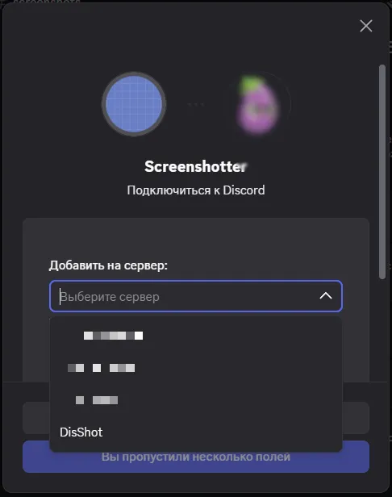
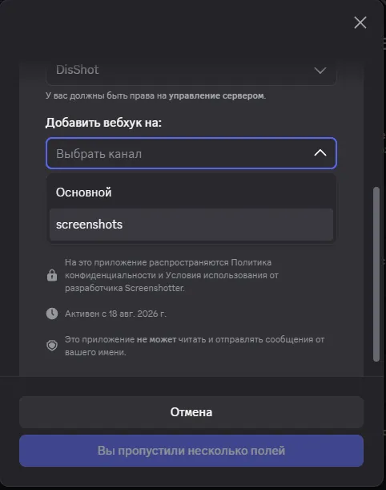
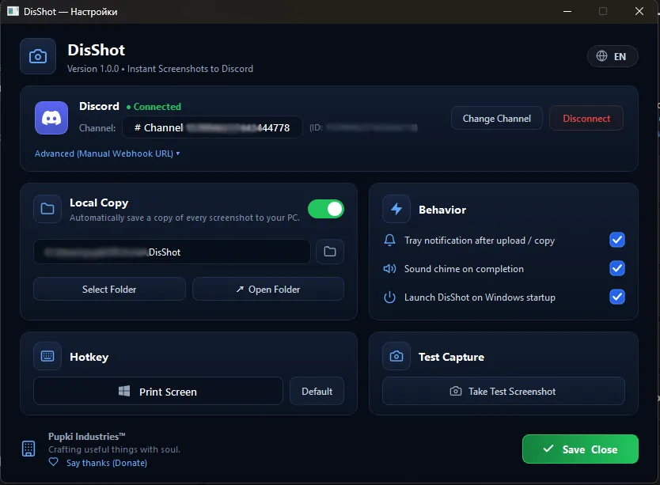

<div align="center">

# 📸 DisShot

**Fast, lightweight, and 100% private screenshot utility for Windows.**  
Captures screen areas with annotations and uploads directly to your personal Discord channel with instant CDN links in your clipboard.

[](LICENSE)
[](https://github.com/SeasonForge/DisShot/releases)
[](https://discord.com)
[](https://python.org)
[](https://github.com/SeasonForge/DisShot)

```text
[ PrintScreen ] ──► [ Select Area & Blur/Arrow ] ──► [ Direct Discord CDN Link in Clipboard ] (Ctrl + V)
```

[**Website & Live Demo**](https://disshot.vercel.app/) • [**Download .EXE**](https://github.com/SeasonForge/DisShot/releases/latest) • [**Bug Reports**](https://github.com/SeasonForge/DisShot/issues)

</div>

---

## ✨ Why DisShot?

Traditional screenshot services (Lightshot, Gyazo, etc.) store your private data on third-party servers with predictable short URLs that web crawlers can scrape. 

**DisShot operates differently:**
* **100% Private Cloud:** Your screenshots are uploaded directly from your PC to your private Discord channel.
* **No Middleman Servers:** Only you and the people you share the direct Discord CDN link with can view the image.
* **Instant Sharing:** Press your hotkey, select the area, and the cryptographically secure `cdn.discordapp.com/...` link is already in your clipboard ready to paste (`Ctrl+V`).

---

## 🖼️ Screenshots & Interface

<div align="center">
  <table>
    <tr>
      <td align="center"><b>1. One-Click Discord OAuth2</b></td>
      <td align="center"><b>2. Select Private Server & Channel</b></td>
    </tr>
    <tr>
      <td></td>
      <td></td>
    </tr>
    <tr>
      <td colspan="2" align="center"><b>3. Preferences & Custom Hotkeys</b></td>
    </tr>
    <tr>
      <td colspan="2" align="center"></td>
    </tr>
  </table>
</div>

---

## 🚀 Key Features

* 🎯 **Annotation Tools on the Fly:** Clean arrows, rectangular highlight frames, and instant data blur tool for sensitive tokens/passwords.
* 🔒 **Hardware-Backed Encryption:** Tokens and configuration are encrypted locally using Windows DPAPI (`CryptProtectData`).
* 🖥️ **DPI-Aware & Multi-Monitor Support:** Virtual desktop composite capture across multi-display setups without scaling distortion.
* 🌐 **Discord OAuth2 Integration:** Official one-click login and automatic channel dropdown selector.
* 💾 **Dual Storage & Local Backup:** Automatically archives copies of your original screenshots to `Pictures/DisShot`.
* 🌍 **Bilingual UI (i18n):** Native support for Russian (`RU`) and English (`EN`).
* 🪶 **Ultra-Lightweight Background Mode:** Sits quietly in the Windows system tray with `< 15 MB RAM` footprint and global hotkeys.

---

## 📦 Installation & Quick Start

### Option 1: Standalone Portable EXE (Recommended)
Download the latest `DisShot.exe` from [**Releases**](https://github.com/SeasonForge/DisShot/releases/latest) and run it. No installation or Python runtime required.

### Option 2: Run from Source

```bash
# 1. Clone the repository
git clone https://github.com/SeasonForge/DisShot.git
cd DisShot

# 2. Install dependencies
pip install -r requirements.txt

# 3. Run application
python main.py
```

---

## 🛠️ Building Executable

To build a standalone single-file `.exe` using PyInstaller:

```bash
pip install pyinstaller pillow
pyinstaller --noconfirm --onefile --windowed --name "DisShot" --icon "icon.ico" main.py
```

The compiled binary will be placed in `dist/DisShot.exe`.

---

## 📁 Architecture & Codebase

```text
DisShot/
├── main.py                  # Entry point with Win32 DPI awareness setup
├── config.py                # Global configuration & OAuth2 endpoints
├── i18n.py                  # RU / EN localization manager
├── requirements.txt         # Dependencies
├── app/
│   ├── lifecycle.py         # Application state controller
│   ├── tray.py              # System tray icon and menu
│   └── hotkey.py            # Global keyboard hook (pynput)
├── capture/
│   └── sniper.py            # DPI-aware region capture & annotation overlay
├── discord/
│   ├── auth.py              # Discord OAuth2 loopback server & token exchange
│   ├── destination.py       # Discord destination model
│   └── uploader.py          # Discord multipart image uploader
├── clipboard/
│   └── manager.py           # Native Win32 clipboard integration
├── settings/
│   ├── secure_store.py      # Windows DPAPI encryption store
│   └── manager.py           # Local configuration manager
├── ui/
│   ├── setup_dialog.py      # Onboarding & Discord connection wizard
│   ├── settings_dialog.py   # Settings & channel management window
│   └── hotkey_widget.py     # Interactive Hotkey Recorder widget
└── docs/
    └── images/              # Documentation assets & UI screenshots
```

---

## 🛡️ Security & Privacy

1. **Zero Telemetry:** DisShot does not track user actions or send metrics to any third-party services.
2. **Local Client Only:** The software runs strictly locally on your machine and communicates only with official Discord endpoints (`discord.com`).
3. **Open Source:** 100% auditable code under the MIT license.

---

## 📄 License

Distributed under the **MIT License**. See [`LICENSE`](LICENSE) for more information.

Developed with passion by **[Pupki Industries™](https://t.me/pupki_industries)**.
